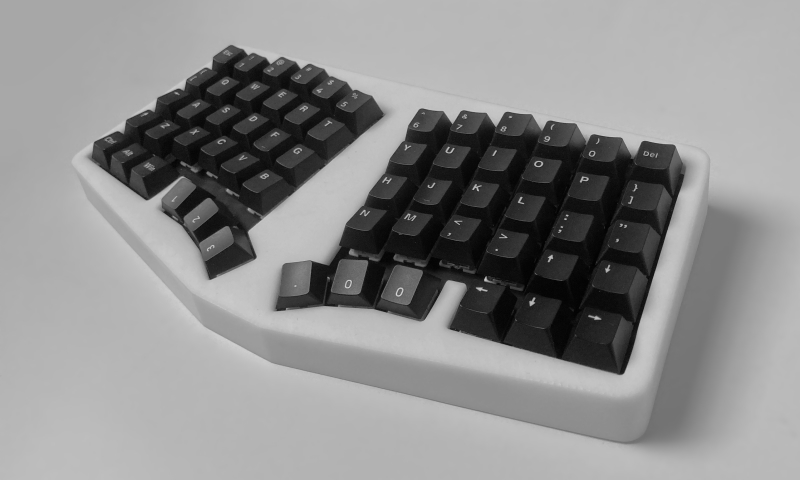
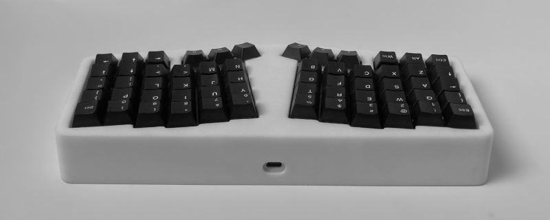
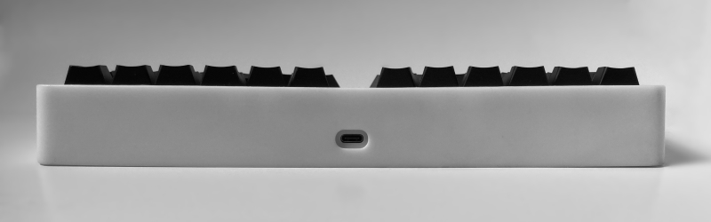

# Form Uno
> Gasket mounted 5x12 column staggered keyboard

## Introduction
I designed this board with a few goals in mind:

### Ergonomic
The layout is based on the corne/cornelius by [foostan](https://github.com/foostan), with some adjustments:
- Unsplit.
- Number row.
- Options for dedicated arrow keys.

### Fully featured
It also comes with the neat features that you'd find in custom mechanical keyboards:

- Gasket-mounted.
- Hotswap PCB + daughterboard.
- Clean and minimal design.

### Easy to build
- Powered by an [RP2040 Tiny](https://www.waveshare.com/rp2040-tiny.htm) and [all the other parts](build) can be easily sourced.
- No tiny SMD components required!

## Build guide
See [build](/build)

## Thanks
- [JLCPCB](https://jlcpcb.com/?from=see) for providing the keyboard plate, 3D printed case, and PCB for this project. If you're looking to build your own board, I highly recommend their services.
- [foostan](https://github.com/foostan) for creating the corne/cornelius, which inspired this project in the first place.