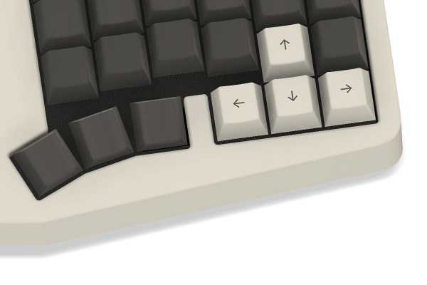
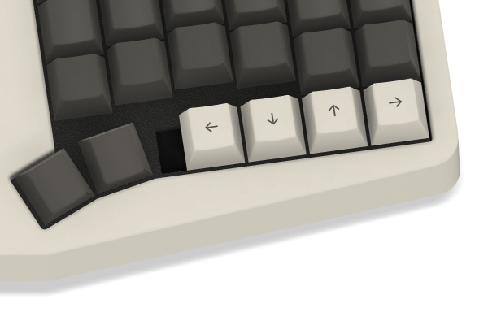
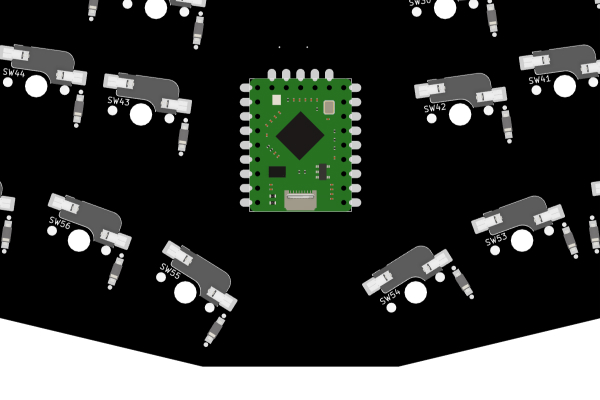
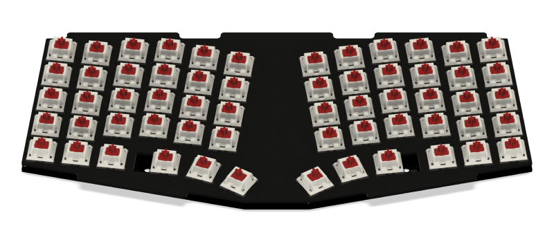
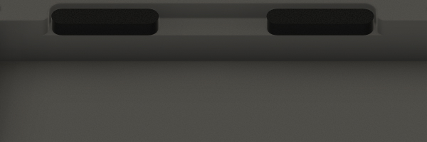
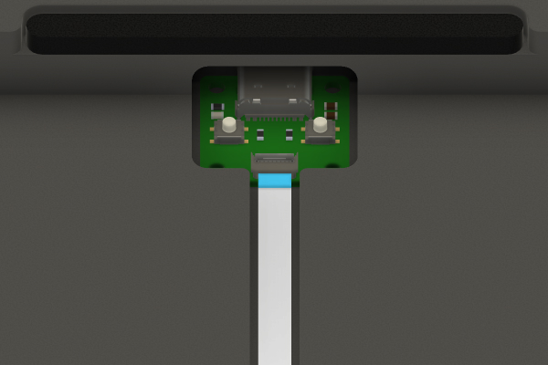
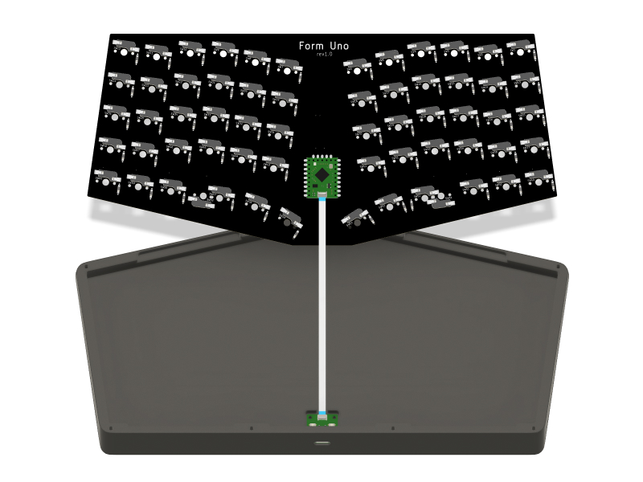
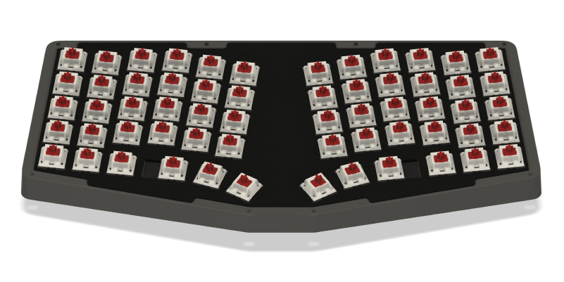
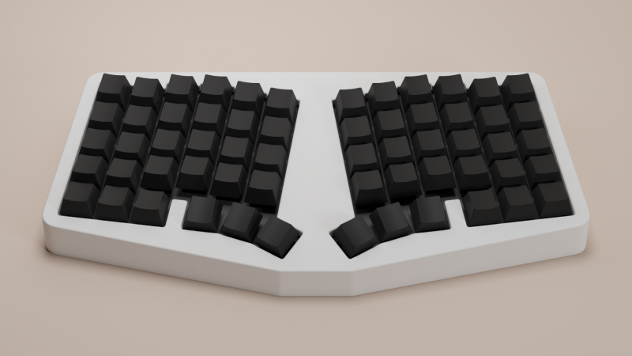

# Build Guide
Please open an issue if you have any questions.

# The parts
I've included links to purchase some of the parts needed for this build. They're all non-affiliate links.

- [3D printed case](./case)
- [RP2040 Tiny](https://www.waveshare.com/rp2040-tiny.htm)
- [PCB](./pcb-gerbers.zip)
- 10 x M2 heat set inserts
    - [These inserts](https://www.aliexpress.com/item/1005003582355741.html) should work.
    - Select these options: `M2(OD 3.5mm)` and `Length 3mm`.
- 10 x M2x6mm screws
- 62 x kailh hotswap sockets
- 60 x 1N4148 diodes
    - The PCB supports both through hole and SMD diodes.
- [Plate](./plate-gerbers.zip)
- 10 x poron gaskets
    - If you want the gaskets to fit the case perfectly, buy these [D65 gaskets](https://www.aliexpress.com/item/1005004488920878.html).
    - Smaller gaskets should also work, as long as they provide enough tension to securely hold the plate in place. **Just make sure the gaskets are 3mm thick.**

# Build the board
## Firmware
This repo doesn't include the firmware for the board, so you'll need to build it yourself using [QMK](https://github.com/qmk/qmk_firmware).

```json
"matrix_pins": {
    "cols": ["GP29", "GP28", "GP27", "GP26", "GP14", "GP15", "GP7", "GP8", "GP6", "GP5", "GP4", "GP3"],
    "rows": ["GP10", "GP11", "GP12", "GP13", "GP2"]
},
```

## Prepare the case
### Print the case
There are a few options for the case. You can choose either the FDM case or the resin case. They are almost identical. The only difference is that the holes for the threaded inserts are larger on the resin case.

There's also the option to print the top case with or without blockers. By default, each half has three thumb keys, with a blocker separating the bottom keys.



Without the blocker, the innermost thumb key can be moved to the right.



### Install threaded inserts

Once the case is printed, install the threaded inserts. You'll need to install 8 on the top case and 2 on the bottom case, where the daughterboard is mounted.

## Solder the parts
Start by soldering the hotswap sockets and the diodes. I recommend using through-hole diodes, as they are much easier to work with than the SMD ones.

Next, solder the RP2040 Tiny to the PCB.



If you're unfamiliar with soldering castellated holes, check out [this video](https://www.youtube.com/watch?v=rGvvwXrv310).

## Install the switches
The board doesn't come with standoffs, so it might be a little tricky to install the switches. Watch [this video](https://www.youtube.com/watch?v=MtzzKFZqiPw&t=303s) if you're not sure how to do it properly.




I also highly recommend performing the PE foam mod and tape mod at this step. From my experience, these two mods greatly improve the sound of the board.

## Install the gaskets

Install the gaskets (4x60mm) on the top and bottom case (there are 10 in total).


Smaller gaskets should also work.



## Assemble the board

Screw in the daughter board.



Connect the daughterboard to the PCB.



Place everything on top of the bottom case.



Screw in the top case and put on the keycaps. You're done!

